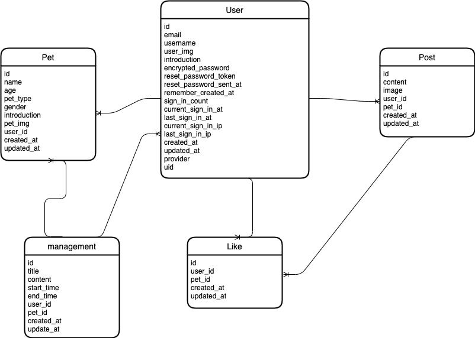
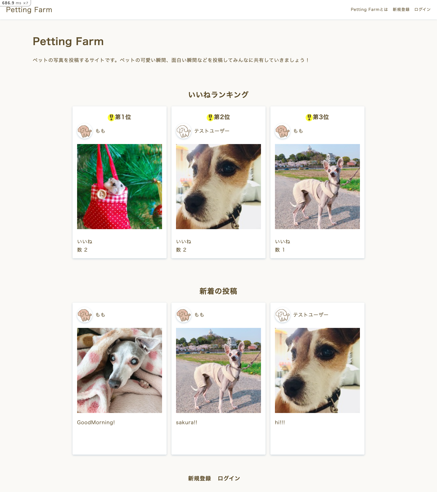
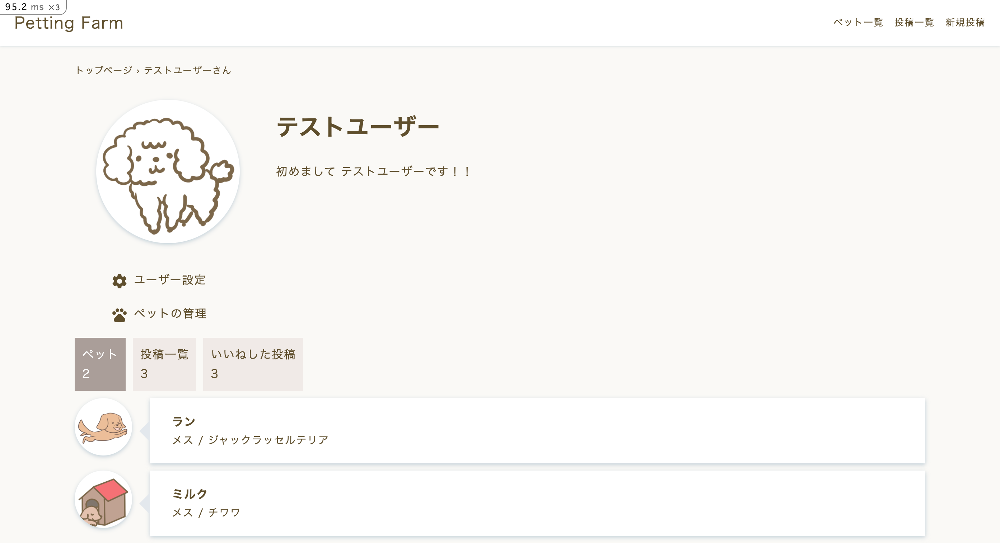
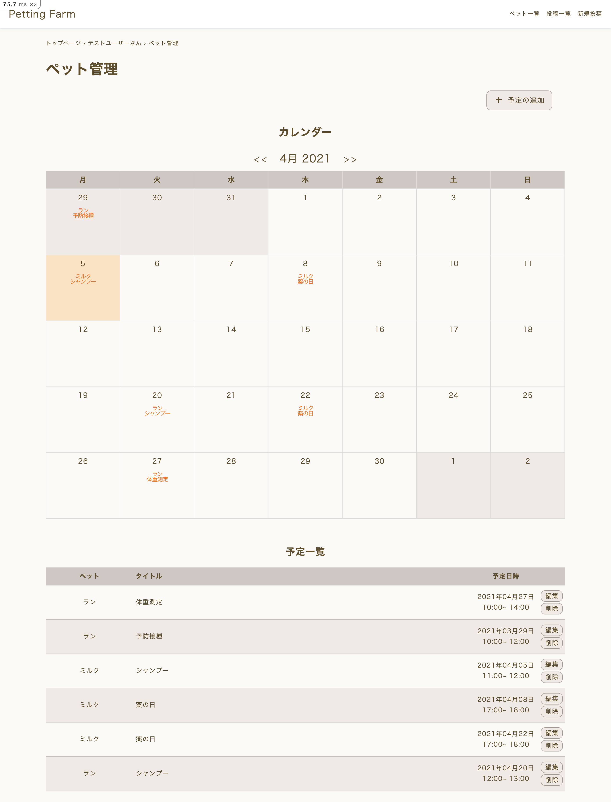

# Petting Farm

## サービス概要
ペットの写真を投稿できるWebアプリケーションです。  

Petting Farm = "動物園のふれあいコーナー" という意味で、動物とのふれあいをより身近に感じられるようなサイトをみんなで作っていきたいという思いから制作しました。投稿機能だけでなく、「うちの犬、いつシャンプーしてあげたっけ？」「 フィラリア予防の薬与え忘れちゃった！」などにならないようにペット管理機能もつけました。ログインして自分のペットを登録すると、ペットの予定をカレンダーに保存できます。

## 作る上で意識した事
レスポンシブ対応のデザインになっているのでどんな画面サイズでも使いやすいようにしました。  
見た目だけでなく、実際に運用する事となった場合を想定し、そのために必要な技術も多数取り入れました。

- admin状態のユーザーだけがアクセスできる管理画面
- サイトマップやメタタグを用いたSEO対策
- brakemanを用いたセキュリティー対策
- コードチェックをして、読みやすく、綺麗なコードを意識

他にも、GitHubの機能を活用し、「issueを確認 - branchを切る - 開発を行う - pushする - pull requestを送信する - mergeする」といったチーム開発の流れをイメージして、より実践的な環境で作業を進めました。

## URL
https://pettingfarm.herokuapp.com/

＊ページ内には「簡単ログイン（テストユーザーとしてログインができる機能）」も実装してありますので、そちらをご利用いただけると幸いです。

## 開発環境
- Ruby 2.6.6
- Rails 6.1.3

## ER図

## 各種機能＆導入技術
- プラットフォーム (Heroku)
- データベース (MySQL, PostgleSQL)
- ログイン (device)
- コードチェック (rubocop)
- セキュリティチェック (brakeman)
- 画像アップロード (carrierwave、mini_magick)
- ページネーション (kaminari)
- いいね (Ajax)
- 検索 (ransack)
- カレンダー (simple_calendar)
- パンくずリスト (gretel)
- 管理者画面 (admin)
- SEO対策 (meta-tags、sitemap_generator)

## トップページ

## マイページ

## ペット管理ページ
